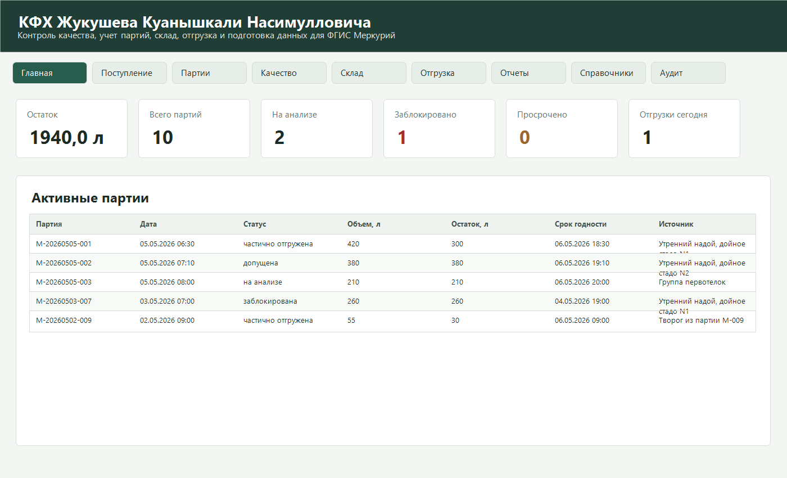
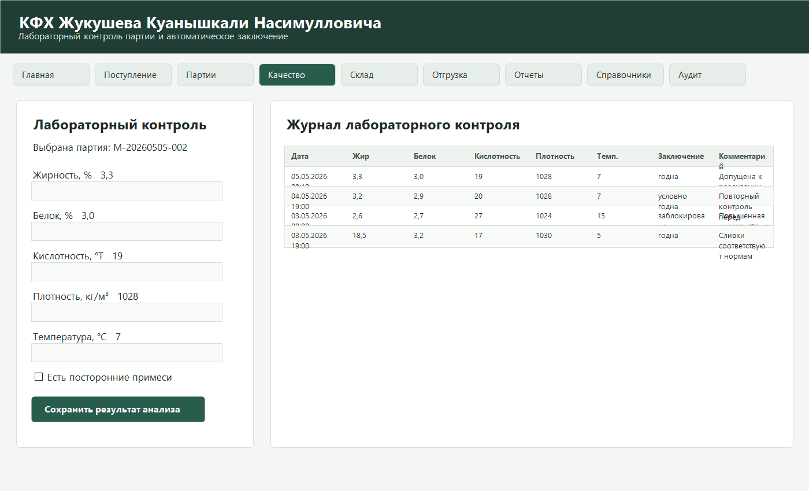
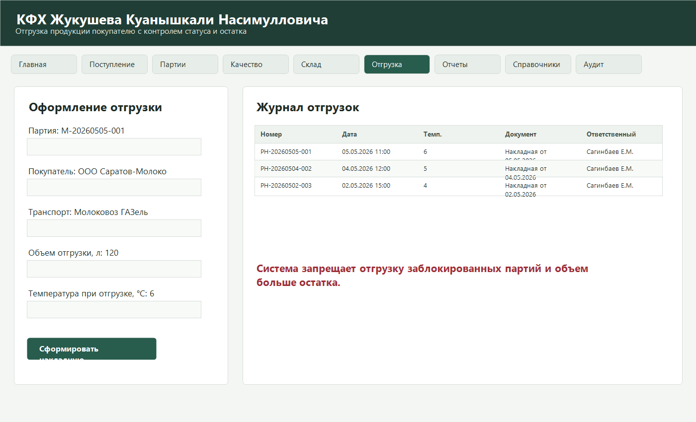
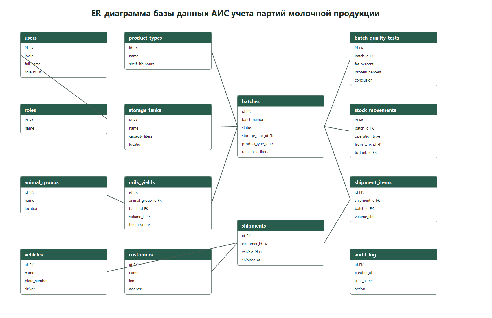

# Министерство образования Саратовской области

# Государственное автономное профессиональное образовательное учреждение Саратовской области «Новоузенский агротехнологический техникум»

Допущен к защите

Заместитель директора по учебной работе

________________________ Фамилия И.О.

«____» ______________ 2026 г.

# ДИПЛОМНЫЙ ПРОЕКТ

Тема: «Разработка автоматизированной информационной системы контроля качества и учета производственных партий молочной продукции КФХ Жукушева Куанышкали Насимулловича»

Специальность: 09.02.07 Информационные системы и программирование

Руководитель: ________________________

Разработал студент: ________________________

г. Новоузенск, 2026 г.

\page

# Задание для выполнения дипломного проекта

Специальность: 09.02.07 Информационные системы и программирование.

Ф.И.О. студента: ________________________________.

Тема проекта: «Разработка автоматизированной информационной системы контроля качества и учета производственных партий молочной продукции КФХ Жукушева Куанышкали Насимулловича».

Цель дипломного проекта: разработать настольную автоматизированную информационную систему, обеспечивающую учет поступления сырого молока, формирование производственных партий, регистрацию лабораторного контроля, складских операций, отгрузок и подготовку данных для ветеринарного сопровождения продукции.

Содержание дипломного проекта:

- введение;
- теоретическая часть;
- основные конструкции для разработки автоматизированной информационной системы;
- выбор программ и алгоритмы реализации программного обеспечения;
- практическая часть;
- создание информационной системы;
- реализация на компьютере;
- тестирование и устранение ошибок;
- апробация;
- информационная безопасность и охрана труда;
- заключение;
- список использованных источников;
- приложения.

Дата выдачи задания: «____» ______________ 2026 г.

Руководитель дипломного проекта: ________________________

Студент: ________________________

\page

# ОГЛАВЛЕНИЕ

ВВЕДЕНИЕ

1 ТЕОРЕТИЧЕСКАЯ ЧАСТЬ

1.1 Основные конструкции для разработки автоматизированной информационной системы

1.2 Выбор программ и алгоритмы реализации программного обеспечения

1.2.1 Анализ предметной области и требований к учету молочной продукции

1.2.2 Выбор программных средств и архитектуры реализации

1.2.3 Алгоритмы работы автоматизированной информационной системы

2 ПРАКТИЧЕСКАЯ ЧАСТЬ

2.1 Создание автоматизированной информационной системы

2.1.1 Определение целей и задач разработки

2.1.2 Разработка структуры

2.1.3 Разработка содержания и проектирование базы данных

2.2 Реализация на компьютере

2.3 Тестирование и устранение ошибок в работе

2.4 Апробация

2.5 Описание пользовательского интерфейса

2.6 Демонстрационные данные для проверки системы

2.7 Развертывание и настройка программного продукта

2.8 Возможности дальнейшего развития

3 ИНФОРМАЦИОННАЯ БЕЗОПАСНОСТЬ И ОХРАНА ТРУДА

3.1 Информационная безопасность

3.2 Охрана труда при работе с персональным компьютером

ЗАКЛЮЧЕНИЕ

СПИСОК ИСПОЛЬЗОВАННЫХ ИСТОЧНИКОВ

ПРИЛОЖЕНИЯ

\page

# ВВЕДЕНИЕ

Современное сельское хозяйство постепенно переходит от бумажных журналов и разрозненных электронных таблиц к специализированным информационным системам. Особенно заметна эта необходимость в тех хозяйствах, где производимая продукция связана с требованиями безопасности, прослеживаемости и ветеринарного сопровождения. Молочная продукция относится к такой категории: для каждой партии необходимо знать источник сырья, дату производства, объем, результаты лабораторного контроля, условия хранения, остаток и сведения об отгрузке.

Крестьянское фермерское хозяйство Жукушева Куанышкали Насимулловича находится в Новоузенском районе Саратовской области и ведет учет молочной продукции небольшими производственными партиями. Особенность такого хозяйства состоит в том, что один сотрудник может совмещать несколько ролей: оператор учета одновременно регистрирует поступления, кладовщик фиксирует складские операции, а ответственный за качество вносит результаты лабораторной проверки. При этом постоянное подключение к сети Интернет не всегда гарантировано, поэтому информационная система должна сохранять работоспособность локально и не зависеть от внешних сервисов при выполнении основных операций.

Актуальность темы обусловлена необходимостью повышения точности учета, снижения риска ошибок при ручном заполнении журналов, ускорения подготовки отчетных документов и обеспечения прослеживаемости партий молочной продукции. Без автоматизированной системы сведения о надоях, качестве, емкостях хранения и отгрузках приходится сверять вручную. Это увеличивает время работы сотрудников, повышает вероятность расхождений между складскими остатками и документами, а также затрудняет подготовку данных для ветеринарного специалиста и последующего переноса сведений во ФГИС «Меркурий».

Нормативная значимость разработки связана с требованиями технического регламента Таможенного союза ТР ТС 033/2013 «О безопасности молока и молочной продукции». Данный регламент устанавливает требования к молоку и молочной продукции, процессам производства, хранения, перевозки, реализации, утилизации и маркировке. Следовательно, информационная система должна помогать фиксировать сведения, подтверждающие контроль качества, соблюдение условий хранения и движение продукции от поступления сырья до реализации.

Цель дипломного проекта заключается в разработке автоматизированной информационной системы контроля качества и учета производственных партий молочной продукции для КФХ Жукушева Куанышкали Насимулловича.

Для достижения цели были поставлены следующие задачи:

- изучить предметную область учета молочной продукции и требования к прослеживаемости партий;
- определить функциональные требования к системе учета поступления, контроля качества, склада и отгрузки;
- спроектировать структуру базы данных и основные сущности информационной системы;
- реализовать настольное приложение на C# WPF с использованием архитектуры MVVM;
- подключить PostgreSQL для хранения данных и предусмотреть автономный резервный вариант хранения;
- провести тестирование основных сценариев работы системы.

Объектом исследования являются процессы учета, контроля качества, хранения и отгрузки молочной продукции в фермерском хозяйстве.

Предметом исследования является автоматизация учета производственных партий молочной продукции средствами настольного приложения и базы данных PostgreSQL.

Практическая значимость дипломного проекта состоит в создании программного продукта, который может использоваться на рабочем месте КФХ для регистрации надоев, формирования партий, внесения лабораторных показателей, контроля остатков, оформления отгрузок и подготовки отчетных данных. Разработанная система ориентирована на пользователей без специальной технической подготовки и учитывает реальные условия эксплуатации в небольшом сельскохозяйственном хозяйстве.

Новизна проекта заключается в адаптации типовой архитектуры настольной информационной системы к задачам небольшого фермерского хозяйства: система совмещает учет сырого молока, производственных партий, лабораторного контроля, складских операций и отгрузки в едином интерфейсе, предусматривает подсветку отклонений качества и ограничивает операции с заблокированными партиями.

Методологическую основу проекта составили методы анализа предметной области, объектно-ориентированного проектирования, проектирования реляционных баз данных, разработки пользовательского интерфейса, модульного тестирования сценариев и анализа требований к информационной безопасности.

Дипломный проект состоит из введения, теоретической части, практической части, раздела по информационной безопасности и охране труда, заключения, списка использованных источников и приложений. В теоретической части рассматриваются понятия автоматизированных информационных систем, особенности учета молочной продукции и выбор средств разработки. В практической части описывается проектирование и реализация программы, структура базы данных, основные экраны приложения и результаты тестирования.

\page

# 1 ТЕОРЕТИЧЕСКАЯ ЧАСТЬ

## 1.1 Основные конструкции для разработки автоматизированной информационной системы

Автоматизированная информационная система представляет собой совокупность программных, технических, информационных и организационных средств, предназначенных для сбора, хранения, обработки и выдачи информации пользователям. В отличие от обычного набора файлов или электронных таблиц, информационная система обеспечивает целостность данных, разграничение доступа, формирование отчетов, контроль ошибок ввода и поддержку повторяемых бизнес-процессов.

Для разработки системы учета молочной продукции ключевое значение имеют следующие понятия:

- пользователь системы — сотрудник, выполняющий операции в соответствии со своей ролью;
- роль — набор прав и обязанностей пользователя, определяющий доступ к функциям системы;
- надой — факт поступления сырого молока от определенной группы животных за конкретное время;
- производственная партия — учетная единица молочной продукции, которой присваивается уникальный номер;
- лабораторный контроль — регистрация показателей качества партии и формирование заключения;
- складское движение — операция поступления, перемещения, списания, возврата или отгрузки;
- отгрузка — передача продукции покупателю с указанием объема, транспорта и температуры;
- аудит — журнал действий пользователей, необходимый для контроля изменений.

В проектируемой системе эти понятия становятся сущностями предметной области. Каждая сущность имеет набор атрибутов и связей с другими сущностями. Например, партия связана с надоями, емкостью хранения, результатами лабораторного контроля, складскими движениями и документами. Такая связь позволяет отследить путь продукции: животноводческая группа, надой, партия, хранение, качество, отгрузка.

Основной принцип построения системы — прослеживаемость. Прослеживаемость означает возможность восстановить историю каждой партии продукции от момента получения сырого молока до момента реализации. Для молочной продукции это особенно важно, поскольку качество и безопасность зависят от температуры, сроков хранения, результатов анализов и условий транспортировки.

Другой важный принцип — достоверность учета. Данные должны вводиться один раз и далее использоваться в разных разделах системы. Если партия создана в журнале поступления, она должна автоматически появиться в списке партий и складских остатках. Если лаборатория присвоила партии статус «заблокирована», система должна запрещать ее отгрузку. Если часть партии отгружена, остаток должен уменьшиться автоматически.

При проектировании интерфейса учитывается, что система предназначена для небольшого фермерского хозяйства. Поэтому программа не должна требовать сложной настройки, постоянного подключения к сети или длительного обучения. Основные операции должны выполняться через понятные формы: регистрация надоя, ввод анализа, перемещение на складе, оформление отгрузки, формирование отчета.

Для реализации системы выбрана настольная архитектура. Настольное приложение удобно для локальной работы на обычном офисном компьютере, может взаимодействовать с локальной базой данных и сохраняет доступность даже при нестабильном Интернете. Такой подход соответствует условиям сельского хозяйства, где надежность локального учета часто важнее постоянной сетевой интеграции.

С точки зрения программной архитектуры используется разделение на слои:

- слой представления — WPF-интерфейс пользователя;
- слой модели представления — ViewModel с командами и состоянием экранов;
- слой бизнес-логики — правила создания партий, контроля качества, отгрузки и списания;
- слой доступа к данным — сохранение и загрузка данных из PostgreSQL или локального JSON;
- слой базы данных — таблицы PostgreSQL и связи между ними.

Такое разделение облегчает сопровождение программы. Изменение интерфейса не требует переписывания структуры базы данных, а замена локального JSON-хранилища на PostgreSQL выполняется через общий интерфейс хранилища данных.

## 1.2 Выбор программ и алгоритмы реализации программного обеспечения

### 1.2.1 Анализ предметной области и требований к учету молочной продукции

Предметная область проекта связана с производством и учетом молочной продукции в крестьянском фермерском хозяйстве. Процесс учета начинается с поступления сырого молока. На этом этапе необходимо зафиксировать дату и время дойки, источник молока, объем, массу, температуру при приемке и ответственного сотрудника. Далее молоко объединяется в производственную партию, которой присваивается уникальный номер.

Партия является центральной учетной единицей системы. Для партии фиксируются:

- номер партии;
- дата формирования;
- источник;
- объем в литрах;
- масса в килограммах;
- текущий остаток;
- статус;
- емкость хранения;
- срок годности;
- ответственный пользователь;
- история операций.

Статусы партии отражают ее жизненный цикл. В проекте используются статусы: «создана», «на анализе», «допущена», «заблокирована», «частично отгружена», «полностью отгружена», «списана». Такая модель позволяет быстро понять, что можно делать с партией. Например, партия «на анализе» еще не должна отгружаться, а партия «заблокирована» не может быть реализована до принятия решения ответственным лицом.

Контроль качества является одним из главных разделов системы. Для молочной продукции значимы жирность, белок, кислотность, плотность, температура, органолептическая оценка и наличие посторонних примесей. Вручную контролировать отклонения по каждому показателю неудобно, поэтому система автоматически сравнивает введенные значения с нормами и формирует заключение: «годна», «условно годна», «заблокирована» или «списана».

Складской учет необходим для контроля остатков по партиям и емкостям. В небольшом хозяйстве молоко может храниться в охладителях, приемных емкостях и холодильной камере. Каждое перемещение должно фиксироваться, чтобы в любой момент можно было получить складскую ведомость и определить фактический остаток продукции.

Отгрузка связана не только с уменьшением остатка, но и с подготовкой товаросопроводительных сведений. При оформлении отгрузки указываются покупатель, партия, объем, транспорт, температура и документ-основание. Эти данные нужны для накладной, внутреннего отчета и ручного переноса сведений во ФГИС «Меркурий».

ФГИС «Меркурий» применяется для электронной ветеринарной сертификации и прослеживаемости подконтрольных товаров. На первом этапе дипломного проекта не реализуется прямое API-подключение, поскольку для этого требуются учетные данные, утвержденный порядок обмена и организационные настройки. Однако система формирует структурированные данные, которые можно использовать при ручном переносе: партия, объем, дата производства, вид продукции, получатель, транспорт и документ-основание.

Анализ предметной области показал, что для автоматизации учета необходимо реализовать следующие функциональные группы:

- учет пользователей и ролей;
- справочники групп животных, типов продукции, покупателей, транспорта и емкостей;
- журнал поступления молока;
- список производственных партий;
- ввод результатов качества;
- складские операции;
- оформление отгрузок;
- отчеты и экспорт;
- журнал аудита;
- резервное копирование.

Отдельное внимание уделяется ограничениям надежности. Система должна предотвращать отрицательные объемы, запрещать отгрузку объема больше остатка, предупреждать о просроченных партиях и блокировать партии с неудовлетворительным качеством. Эти требования реализуются на уровне бизнес-логики приложения.

### 1.2.2 Выбор программных средств и архитектуры реализации

Для разработки программного продукта выбран язык программирования C# и платформа .NET 8. C# является современным объектно-ориентированным языком, широко применяемым для разработки настольных, серверных и корпоративных приложений. Платформа .NET 8 относится к актуальным версиям .NET и поддерживает создание WPF-приложений для Windows.

В качестве технологии интерфейса выбрана Windows Presentation Foundation. WPF позволяет создавать настольные приложения с гибкой разметкой, привязкой данных, стилями и поддержкой шаблона MVVM. Для информационной системы, где основная работа строится вокруг форм, таблиц и команд, WPF является удобным и устойчивым решением.

Архитектурный шаблон MVVM разделяет приложение на три части:

- Model — доменные сущности и данные;
- View — XAML-разметка пользовательского интерфейса;
- ViewModel — состояние экранов, команды и бизнес-логика взаимодействия.

Преимущество MVVM состоит в том, что интерфейс не содержит сложной логики. Команды создания партии, сохранения анализа или оформления отгрузки находятся во ViewModel, а экран только отображает данные и вызывает команды. Это повышает читаемость кода и упрощает дальнейшую доработку.

Для постоянного хранения данных выбрана PostgreSQL. PostgreSQL — надежная реляционная система управления базами данных, поддерживающая транзакции, индексы, ограничения целостности, тип UUID, связи между таблицами и расширяемый SQL. Для системы учета партий важно, чтобы данные сохранялись надежно и могли обрабатываться запросами для отчетов.

Для подключения C#-приложения к PostgreSQL используется библиотека Npgsql. Она является .NET-провайдером для PostgreSQL и позволяет выполнять SQL-команды, читать данные, передавать параметры и работать с транзакциями. В дипломном проекте Npgsql используется без тяжелого ORM-слоя, поскольку прямые SQL-запросы позволяют лучше показать структуру базы и контролировать процесс сохранения данных.

Для резервного автономного режима используется локальное JSON-хранилище. Если PostgreSQL временно недоступен или строка подключения указана неверно, приложение не завершается аварийно, а переключается на локальный режим и показывает причину в строке состояния. Такой подход важен для сельского хозяйства, где технические условия могут быть нестабильными.

Строка подключения хранится в файле `database.json`. Это позволяет менять адрес сервера, имя базы, пользователя и пароль без перекомпиляции приложения. Пример строки подключения:

`Host=localhost;Port=5432;Database=moloko;Username=postgres;Password=postgres`

Структура проекта включает следующие основные каталоги:

- `Models` — доменные модели данных;
- `ViewModels` — модель представления главного окна;
- `Services` — сервисы хранения данных и подключения к PostgreSQL;
- `Infrastructure` — вспомогательные классы команд и преобразователей;
- `Database` — SQL-схема PostgreSQL.

Выбранная архитектура соответствует требованиям дипломного проекта, поскольку демонстрирует проектирование информационной системы, создание базы данных, реализацию интерфейса, алгоритмы работы с данными, контроль ошибок и возможность дальнейшего развития.

### 1.2.3 Алгоритмы работы автоматизированной информационной системы

Основные алгоритмы системы связаны с созданием партии, проведением лабораторного контроля, выполнением складской операции и оформлением отгрузки.

Алгоритм создания партии:

- пользователь выбирает группу животных, тип продукции и емкость хранения;
- вводит объем, массу и температуру приемки;
- система проверяет, что объем и масса являются положительными значениями;
- формируется уникальный номер партии по текущей дате и порядковому номеру;
- создается запись надоя и запись партии;
- партия получает статус «на анализе»;
- создается складское движение типа «поступление»;
- действие записывается в журнал аудита;
- данные сохраняются в хранилище.

Алгоритм контроля качества:

- пользователь выбирает партию;
- вводит жирность, белок, кислотность, плотность, температуру и признак посторонних примесей;
- система проверяет положительность числовых показателей;
- значения сравниваются с установленными нормами;
- при отсутствии отклонений формируется заключение «годна»;
- при мягких отклонениях формируется заключение «условно годна»;
- при критических отклонениях формируется заключение «заблокирована»;
- статус партии обновляется;
- результат сохраняется в журнал лабораторного контроля.

Алгоритм отгрузки:

- пользователь выбирает партию, покупателя и транспорт;
- вводит объем отгрузки и температуру;
- система проверяет, что партия не заблокирована и не списана;
- система проверяет, что партия допущена лабораторией;
- система проверяет, что объем отгрузки не превышает остаток;
- создается отгрузка и позиция отгрузки;
- остаток партии уменьшается;
- статус партии становится «частично отгружена» или «полностью отгружена»;
- создается складское движение типа «отгрузка»;
- данные сохраняются.

Алгоритм резервного копирования:

- пользователь нажимает кнопку создания резервной копии;
- система сохраняет актуальные данные;
- формируется файл резервной копии с датой и временем;
- путь к файлу записывается в журнал аудита;
- пользователь получает сообщение о результате.

Таким образом, алгоритмы системы построены вокруг правил учета и контроля качества. Они не только выполняют сохранение данных, но и предотвращают типовые ошибки: отрицательные объемы, превышение остатка, отгрузку заблокированной партии и работу с непроверенной продукцией.

\page

# 2 ПРАКТИЧЕСКАЯ ЧАСТЬ

## 2.1 Создание автоматизированной информационной системы

### 2.1.1 Определение целей и задач разработки

Практическая часть дипломного проекта посвящена созданию программного продукта — настольной автоматизированной информационной системы учета партий молочной продукции. Система разрабатывалась для локального использования в КФХ Жукушева К.Н. и должна обеспечивать выполнение основных учетных операций без постоянного подключения к Интернету.

Главная цель разработки — создать удобную программу, которая объединяет журналы поступления молока, лабораторного контроля, складского учета, отгрузок и отчетов. До автоматизации такие сведения обычно фиксируются в бумажных журналах или отдельных электронных файлах. Это затрудняет поиск информации, увеличивает время подготовки отчетов и создает риск несоответствия данных.

Для реализации цели были определены практические задачи:

- разработать доменную модель данных;
- создать структуру пользовательского интерфейса;
- реализовать команды создания партий, анализа, перемещения, списания и отгрузки;
- спроектировать SQL-схему PostgreSQL;
- реализовать подключение к базе данных;
- добавить демонстрационные данные для проверки работы;
- провести сборку и тестирование приложения.

В результате разработки создано WPF-приложение `Moloko`, которое запускается как настольная программа Windows. Основное окно содержит вкладки: «Главная», «Поступление», «Партии», «Качество», «Склад», «Отгрузка», «Отчеты», «Справочники», «Аудит».

### 2.1.2 Разработка структуры

Структура программы построена по принципу разделения ответственности. Основной проект содержит следующие части:

Таблица 1 — Структура проекта

| Каталог | Назначение |
| --- | --- |
| Models | Классы сущностей: пользователи, партии, анализы, емкости, отгрузки |
| ViewModels | Логика экранов, команды пользователя, расчет показателей |
| Services | Хранилища данных, подключение к PostgreSQL, резервное копирование |
| Infrastructure | Команды, уведомления об изменениях, преобразователи текста |
| Database | SQL-скрипт создания таблиц PostgreSQL |

Главная ViewModel загружает данные из хранилища, формирует коллекции для отображения в таблицах и предоставляет команды для пользовательских действий. Для привязки данных используется `ObservableCollection`, благодаря чему изменения автоматически отображаются в интерфейсе.

Доменные модели описывают основные объекты предметной области:

- `UserAccount` — пользователь системы;
- `AnimalGroup` — животноводческая группа;
- `ProductType` — тип продукции и срок годности;
- `StorageTank` — емкость хранения;
- `Customer` — покупатель;
- `Vehicle` — транспорт;
- `MilkYield` — надой;
- `Batch` — производственная партия;
- `BatchQualityTest` — результат лабораторного контроля;
- `StockMovement` — складское движение;
- `Shipment` — отгрузка;
- `ShipmentItem` — строка отгрузки;
- `AuditEntry` — запись журнала действий.

Для статусов и типов операций применяются перечисления. Это уменьшает количество ошибок при работе со статусами и делает код более понятным. Например, статус партии хранится как `BatchStatus`, а тип складского движения как `StockOperationType`.

Пользовательский интерфейс построен так, чтобы основные сценарии были доступны с первого экрана. На главной панели отображаются показатели: общий остаток, количество партий, партии на анализе, заблокированные партии, просроченные партии и отгрузки за день. Это позволяет руководителю быстро оценить состояние производства.

Вкладка «Поступление» предназначена для регистрации надоя и создания партии. Вкладка «Качество» позволяет лаборанту внести показатели анализа. Вкладка «Склад» используется для перемещения и списания. Вкладка «Отгрузка» оформляет передачу продукции покупателю. Вкладка «Отчеты» формирует сводную информацию и CSV-выгрузку.

### 2.1.3 Разработка содержания и проектирование базы данных

База данных разработана в PostgreSQL. В ней предусмотрены таблицы, соответствующие основным сущностям системы. Структура базы хранится в файле `Moloko/Database/postgresql_schema.sql`. При запуске приложение проверяет наличие схемы и создает отсутствующие таблицы.

Основные таблицы базы данных:

- `roles`;
- `users`;
- `animal_groups`;
- `product_types`;
- `storage_tanks`;
- `customers`;
- `vehicles`;
- `milk_yields`;
- `batches`;
- `batch_quality_tests`;
- `quality_norms`;
- `stock_movements`;
- `shipments`;
- `shipment_items`;
- `documents`;
- `audit_log`.

Таблица `batches` является центральной. Она содержит номер партии, дату создания, описание источника, объем, массу, остаток, статус, емкость хранения, тип продукции, срок годности и ответственного пользователя.

Таблица `batch_quality_tests` связана с `batches` по `batch_id` и хранит результаты лабораторного контроля. Такая связь позволяет хранить несколько анализов по одной партии, если требуется повторная проверка.

Таблица `stock_movements` хранит все складские операции. Вместо того чтобы просто изменять остаток без истории, система фиксирует каждое поступление, перемещение, списание и отгрузку. Это важно для последующего анализа и восстановления движения продукции.

Таблицы `shipments` и `shipment_items` разделяют общую информацию об отгрузке и конкретные партии в отгрузке. Такой подход позволяет в будущем оформлять одну накладную на несколько партий.

Для ускорения поиска созданы индексы по статусу партии, дате создания, сроку годности, идентификатору партии в анализах и движениях, а также по дате отгрузки. Это важно с учетом требования работы с базой до 100 000 партий.

Фрагмент SQL-описания таблицы партий:

```sql
create table if not exists batches (
    id uuid primary key,
    batch_number text not null unique,
    created_at timestamptz not null,
    source_description text not null,
    volume_liters numeric(12, 3) not null check (volume_liters > 0),
    weight_kg numeric(12, 3) not null check (weight_kg > 0),
    remaining_liters numeric(12, 3) not null check (remaining_liters >= 0),
    status text not null,
    storage_tank_id uuid references storage_tanks(id),
    product_type_id uuid references product_types(id),
    expiration_date timestamptz not null,
    created_by text not null
);
```

Использование ограничений `check` позволяет дополнительно защитить базу от некорректных значений. Даже если ошибка произойдет в приложении, база не позволит сохранить отрицательный объем или массу.

В качестве первичных ключей применяются UUID. Это удобно для настольного приложения, так как идентификаторы можно создавать на стороне программы до сохранения в базу. Такой подход также упрощает возможную будущую синхронизацию с другими системами.

## 2.2 Реализация на компьютере

Реализация выполнена в среде JetBrains Rider. Проект создан на платформе .NET 8 с включенной поддержкой WPF. Основной файл проекта `Moloko.csproj` содержит ссылку на пакет `Npgsql`, который используется для работы с PostgreSQL.

Главное окно приложения описано в файле `MainWindow.xaml`. В нем создана структура вкладок и таблиц. Для отображения данных применяются элементы `DataGrid`, `TextBox`, `ComboBox`, `Button`, `CheckBox`, `TabControl`, `Border`, `StackPanel` и `Grid`.

Код окна минимален: он только инициализирует компонент и назначает `DataContext`:

```csharp
public partial class MainWindow : Window
{
    public MainWindow()
    {
        InitializeComponent();
        DataContext = new MainViewModel();
    }
}
```

Основная логика находится в `MainViewModel`. Такой подход соответствует шаблону MVVM. В ViewModel реализованы команды:

- `CreateBatchCommand`;
- `SaveQualityCommand`;
- `TransferCommand`;
- `WriteOffCommand`;
- `CreateShipmentCommand`;
- `ExportCsvCommand`;
- `BackupCommand`;
- `AddDirectoryCommand`;
- `FillDemoDataCommand`;
- `GenerateReportCommand`.

Команда создания партии проверяет объем и массу, создает объект `Batch`, создает объект `MilkYield`, добавляет складское движение и записывает действие в журнал аудита. После этого данные сохраняются в PostgreSQL.

Команда сохранения качества рассчитывает заключение по нормам. В текущей версии используются следующие базовые нормы: минимальная жирность 2,8%, минимальный белок 2,8%, максимальная кислотность 21, минимальная плотность 1027, максимальная температура 10 °C. При критических отклонениях партия блокируется.

Команда отгрузки содержит важные проверки:

- партия не должна быть заблокирована;
- партия не должна быть списана;
- партия должна быть допущена лабораторией;
- объем отгрузки должен быть положительным;
- объем отгрузки не должен превышать остаток партии.

Если проверка не пройдена, пользователь получает предупреждение, а данные не изменяются. Это предотвращает ошибки, которые часто возникают при ручном учете.

Для работы с хранилищем создан интерфейс `IAppDataStore`. Он позволяет ViewModel не зависеть от конкретного способа хранения. Есть две реализации:

- `PostgreSqlAppDataStore` — основное хранилище в PostgreSQL;
- `AppDataStore` — резервное локальное JSON-хранилище.

Фабрика `AppDataStoreFactory` читает настройки из `database.json` и пытается подключиться к PostgreSQL. Если подключение успешно, приложение работает с базой данных. Если возникает ошибка, например неверный пароль пользователя `postgres`, приложение переключается на JSON и показывает причину в строке состояния.

В программе реализовано демонстрационное заполнение базы. На вкладке «Справочники» находится кнопка «Заполнить демо-данными». Она создает четыре пользователя и четыре роли: администратор, глава КФХ, оператор учета, лаборант. Также создаются справочники групп животных, типов продукции, емкостей, покупателей и транспорта, а также тестовые партии, анализы, складские движения и отгрузки. Это позволяет быстро проверить работу программы и продемонстрировать ее на защите.

Для экспорта реализован CSV-отчет по партиям. Он содержит номер партии, дату, статус, объем, остаток, срок годности и источник. Такой формат можно открыть в Excel и использовать для передачи бухгалтеру или руководителю.

Резервное копирование выполняется путем сохранения актуальных данных в файл. Для PostgreSQL создается JSON-экспорт текущего набора данных, что позволяет иметь резервную копию даже без настройки серверных средств `pg_dump`.

## 2.3 Тестирование и устранение ошибок в работе

Тестирование проводилось по основным сценариям, соответствующим критериям приемки дипломного проекта. Проверялись сценарии создания партии, ввода качества, блокировки партии, отгрузки, списания, экспорта и сохранения данных.

Таблица 2 — Сценарии тестирования

| Сценарий | Ожидаемый результат | Фактический результат |
| --- | --- | --- |
| Создание партии с положительным объемом | Партия создается и получает статус «на анализе» | Выполнено |
| Создание партии с отрицательным объемом | Система показывает предупреждение | Выполнено |
| Ввод нормальных показателей качества | Партия получает статус «допущена» | Выполнено |
| Ввод критических отклонений качества | Партия блокируется | Выполнено |
| Отгрузка заблокированной партии | Операция запрещена | Выполнено |
| Отгрузка объема больше остатка | Операция запрещена | Выполнено |
| Частичная отгрузка партии | Остаток уменьшается, статус меняется | Выполнено |
| Полная отгрузка партии | Остаток становится нулевым | Выполнено |
| Экспорт CSV | Создается файл отчета | Выполнено |
| Резервное копирование | Создается файл резервной копии | Выполнено |

В ходе тестирования была выявлена ошибка запуска: выбранная партия устанавливалась в конструкторе ViewModel до создания команд, поэтому при обновлении состояния команд возникал `NullReferenceException`. Ошибка была устранена добавлением проверки на `null` при вызове `RaiseCanExecuteChanged`. После исправления приложение успешно собирается и запускается.

Также проверялось подключение к PostgreSQL. При неверном пароле база данных возвращала код ошибки `28P01`, означающий ошибку аутентификации. Для удобства пользователя приложение не завершает работу аварийно, а выводит сообщение в строке состояния и переключается на локальное JSON-хранилище. Такой подход повышает надежность эксплуатации.

Сборка проекта выполнялась командой:

```powershell
dotnet build Moloko.sln
```

После внесения исправлений сборка завершилась без ошибок и предупреждений. Это подтверждает корректность структуры проекта и отсутствие компиляционных ошибок.

## 2.4 Апробация

Апробация программного продукта проводилась на демонстрационных данных, соответствующих работе фермерского хозяйства. В базу были внесены пользователи, роли, группы животных, типы продукции, емкости хранения, покупатели, транспорт, производственные партии, результаты анализов, складские движения и отгрузки.

Во время апробации были проверены типовые действия сотрудников:

- оператор регистрирует утренний надой и создает партию;
- лаборант вводит показатели качества и получает автоматическое заключение;
- кладовщик выполняет перемещение или списание;
- оператор оформляет отгрузку покупателю;
- руководитель просматривает главную панель и отчет.

В результате апробации установлено, что программа позволяет выполнять ключевые операции, предусмотренные техническим заданием. Интерфейс построен крупно и понятно, основные действия вынесены на отдельные вкладки, а предупреждения помогают избежать ошибочного ввода.

Эффект от внедрения системы состоит в следующем:

- сокращается время поиска информации о партии;
- уменьшается риск ошибок при расчете остатка;
- появляется единый журнал лабораторного контроля;
- обеспечивается история складских операций;
- упрощается подготовка данных для отгрузки;
- появляется основа для будущей интеграции с ФГИС «Меркурий».

Разработанная система может быть использована как первый этап цифровизации учета в КФХ. В дальнейшем ее можно развивать: добавить полноценный экран авторизации, печатные формы накладных и актов, интеграцию с API внешних систем, расширенные отчеты в PDF и Excel.

## 2.5 Описание пользовательского интерфейса

Пользовательский интерфейс является важной частью дипломного проекта, поскольку конечные пользователи системы не обязательно имеют специальную подготовку в области информационных технологий. Поэтому при разработке интерфейса были приняты следующие решения: крупные подписи, разделение функций по вкладкам, отсутствие перегруженных меню, отображение текущего состояния системы в верхней части окна.

Главная панель предназначена для быстрого контроля ситуации. На ней отображаются основные показатели: общий остаток молока, количество партий, количество партий на анализе, количество заблокированных партий, просроченные партии и отгрузки за текущий день. Эти показатели нужны руководителю и ответственному сотруднику для оперативного принятия решений.



Экран «Поступление» ориентирован на оператора учета. Он содержит форму регистрации надоя. Пользователь выбирает животноводческую группу, тип продукции и емкость хранения, затем вводит объем, массу и температуру. После нажатия кнопки «Создать партию» система автоматически формирует номер партии и создает складское движение. Журнал поступления отображается рядом, поэтому пользователь сразу видит результат выполненной операции.

Экран «Партии» является центральным для работы с продукцией. В левой части размещается таблица партий, в правой — карточка выбранной партии. В карточке отображаются номер, статус, объем, остаток, срок годности, источник и история операций. Такой подход позволяет не открывать отдельные окна для просмотра деталей и ускоряет работу.

Экран «Качество» предназначен для лаборанта или ответственного за качество. Пользователь выбирает партию, вводит показатели анализа и сохраняет результат. Система автоматически определяет заключение. Если показатели выходят за допустимые значения, партия получает соответствующий статус. Это снижает зависимость от ручного анализа и помогает не пропустить критическое отклонение.



Экран «Склад» используется для операций с емкостями и остатками. В текущей версии реализованы перемещение и списание. При списании остаток партии уменьшается, а операция фиксируется в журнале складских движений. В дальнейшем этот экран можно расширить инвентаризацией, возвратами и печатью складской ведомости.

Экран «Отгрузка» предназначен для оформления реализации продукции. Пользователь выбирает покупателя, транспорт, объем и температуру при отгрузке. Система проверяет статус партии и остаток. Если партия заблокирована, списана или еще не допущена лабораторией, отгрузка запрещается. Это одно из ключевых требований технического задания.



Экран «Отчеты» позволяет сформировать сводную информацию и выполнить экспорт CSV. Отчет содержит данные, которые могут потребоваться руководителю, бухгалтеру или ветеринарному специалисту: партии, остатки, статус, дата производства и сведения для ФГИС «Меркурий».

Экран «Справочники» содержит пользователей, группы животных, емкости хранения, покупателей и транспорт. Также на этом экране добавлена кнопка заполнения демонстрационными данными. Она используется при первичной проверке и защите дипломного проекта.

Экран «Аудит» показывает журнал действий. В него записываются создание партий, лабораторный контроль, перемещения, списания, отгрузки, экспорт и резервное копирование. Журнал аудита необходим для анализа действий пользователей и восстановления последовательности операций.

## 2.6 Демонстрационные данные для проверки системы

Для проверки работоспособности системы были подготовлены демонстрационные данные. Их цель — показать систему не пустой, а в состоянии, близком к реальной эксплуатации. Это важно для защиты дипломного проекта, поскольку комиссия может увидеть работу всех основных экранов без предварительного ручного заполнения.

В демонстрационном наборе предусмотрены четыре пользователя:

- Жукушев Куанышкали Насимуллович — администратор;
- Жукушева Айгуль Кайратовна — глава КФХ;
- Сагинбаев Ерлан Муратович — оператор учета;
- Петрова Наталья Сергеевна — лаборант.

Также предусмотрены четыре роли: администратор, глава КФХ, оператор учета и лаборант. Эти роли соответствуют основным обязанностям, указанным в техническом задании. В дальнейшем можно добавить роль кладовщика как отдельного пользователя или расширить права существующих сотрудников.

Справочники включают группы животных, типы продукции, емкости хранения, покупателей и транспорт. В систему внесены группы «Дойное стадо N1», «Дойное стадо N2», «Группа первотелок» и «Вечерняя группа». Типы продукции включают сырое молоко, охлажденное молоко, сливки и творог. Это позволяет показать, что система не ограничена одной категорией продукции.

В демонстрационных данных создано несколько партий с разными статусами. Есть партии на анализе, допущенные партии, частично отгруженные, полностью отгруженные, заблокированные и списанные. Такой набор помогает проверить фильтрацию по статусам, отображение карточки партии и контроль отгрузки.

Часть партий имеет результаты лабораторного контроля. В одном случае показатели соответствуют нормам, в другом — есть условные отклонения, в третьем — критические нарушения, приводящие к блокировке. Это демонстрирует работу автоматического заключения.

Также созданы складские движения и отгрузки. Это позволяет проверить изменение остатка и отображение истории операций. Например, при частичной отгрузке остаток партии уменьшается, а статус меняется на «частично отгружена».

Демонстрационные данные загружаются через кнопку «Заполнить демо-данными». Перед заполнением система показывает предупреждение, так как текущие записи будут заменены. Это сделано для защиты от случайной потери рабочих данных.

## 2.7 Развертывание и настройка программного продукта

Для запуска приложения необходим компьютер с операционной системой Windows и установленной платформой .NET 8 Desktop Runtime. Для режима работы с базой данных дополнительно требуется PostgreSQL. Разработка и проверка выполнялись в среде JetBrains Rider.

Порядок развертывания:

- установить PostgreSQL;
- создать базу данных `moloko`;
- указать строку подключения в файле `database.json`;
- запустить приложение `Moloko.exe`;
- проверить строку состояния в верхней части окна;
- при необходимости нажать «Заполнить демо-данными».

Файл `database.json` содержит два параметра: признак использования PostgreSQL и строку подключения. Если параметр `UsePostgreSql` равен `true`, приложение пытается подключиться к базе. Если подключение невозможно, включается резервный режим JSON. Если требуется временно работать только локально, можно указать `UsePostgreSql: false`.

Пример настройки:

```json
{
  "UsePostgreSql": true,
  "ConnectionString": "Host=localhost;Port=5432;Database=moloko;Username=postgres;Password=postgres"
}
```

При первом успешном подключении система выполняет SQL-скрипт создания таблиц. Это упрощает установку, так как пользователю не нужно вручную выполнять все команды. Если таблицы уже существуют, скрипт не разрушает их структуру, а проверяет наличие нужных объектов.

При промышленной эксплуатации рекомендуется создать отдельную учетную запись PostgreSQL, например `moloko_user`, и выдать ей права только на базу `moloko`. Использование суперпользователя `postgres` допустимо для разработки, но не является оптимальным для реальной эксплуатации.

Также рекомендуется регулярно делать резервные копии. В интерфейсе есть ручная кнопка резервного копирования, но для постоянной эксплуатации лучше дополнительно настроить автоматическое ежедневное копирование базы средствами PostgreSQL или планировщика Windows.

## 2.8 Возможности дальнейшего развития

Разработанная система является полноценным рабочим прототипом, однако ее можно развивать в нескольких направлениях.

Первое направление — расширение безопасности. Необходимо реализовать форму входа, хранение хешей паролей, смену пароля пользователем и разграничение доступа к вкладкам. Например, лаборант должен иметь доступ к экрану качества, но не должен редактировать справочники пользователей.

Второе направление — печатные формы. Для практической эксплуатации нужны карточка партии, накладная, акт списания, журнал поступления и журнал лабораторного контроля в формате PDF или печатной формы A4. Это позволит сохранить привычные бумажные документы, но формировать их автоматически.

Третье направление — расширение отчетов. В текущей версии реализована сводка и CSV-экспорт. В дальнейшем можно добавить отчеты за период, диаграммы по объемам, список просроченных партий, отчет по покупателям, отчет по качеству и отчет по складским емкостям.

Четвертое направление — интеграция с ФГИС «Меркурий». На первом этапе система готовит данные для ручного переноса. При наличии учетных данных, электронной подписи и утвержденного порядка обмена можно реализовать программную интеграцию.

Пятое направление — улучшение работы с большим объемом данных. При росте числа партий можно добавить постраничную загрузку таблиц, фильтры по датам, поисковую строку и индексы по дополнительным полям.

Шестое направление — улучшение пользовательского опыта. Можно добавить подсветку просроченных партий, отдельные значки статусов, уведомления о партиях на анализе, быстрый выбор периода отчетов и сохранение пользовательских настроек.

\page

# 3 ИНФОРМАЦИОННАЯ БЕЗОПАСНОСТЬ И ОХРАНА ТРУДА

## 3.1 Информационная безопасность

Информационная безопасность в разработанной системе связана с защитой данных о партиях продукции, пользователях, результатах лабораторного контроля, складских операциях и отгрузках. Потеря или искажение этих данных может привести к ошибкам в учете, неправильному определению остатка, затруднениям при подготовке документов и нарушению прослеживаемости продукции.

Основные угрозы для системы:

- несанкционированный доступ к базе данных;
- ошибочное изменение или удаление записей;
- потеря данных из-за сбоя компьютера;
- ввод некорректных объемов или показателей;
- использование неверной строки подключения;
- отсутствие резервных копий;
- доступ к рабочему месту посторонних лиц.

Для снижения рисков в проекте предусмотрены следующие меры:

- разделение пользователей по ролям;
- журналирование действий в таблице `audit_log`;
- запрет операций с некорректными объемами;
- запрет отгрузки заблокированных партий;
- резервное копирование данных;
- хранение строки подключения в отдельном конфигурационном файле;
- использование PostgreSQL с ограничениями целостности.

В текущей версии система содержит роли пользователей и справочник сотрудников. Следующим этапом развития является реализация полноценного входа по логину и паролю с хранением хеша пароля, а не открытого значения. Для этого может быть применен алгоритм PBKDF2, BCrypt или встроенные средства ASP.NET Core Identity, адаптированные для настольного приложения.

Для PostgreSQL рекомендуется создать отдельного пользователя базы данных, не использовать учетную запись `postgres` для повседневной работы и выдать приложению только необходимые права. Пароль следует хранить в защищенном месте, а файл `database.json` не передавать посторонним лицам.

Резервное копирование должно выполняться ежедневно. В дипломном проекте реализована функция создания резервной копии через интерфейс приложения. Для промышленного режима рекомендуется дополнительно настроить автоматический `pg_dump` по расписанию и хранить копии на внешнем носителе.

Информационная безопасность также обеспечивается за счет контроля бизнес-правил. Пользователь не может отгрузить больше, чем есть в остатке, и не может отгрузить заблокированную партию. Это защищает данные от случайных ошибок, которые могут иметь производственные последствия.

## 3.2 Охрана труда при работе с персональным компьютером

Работа с автоматизированной информационной системой выполняется за персональным компьютером. Поэтому необходимо соблюдать требования охраны труда и техники безопасности при работе с ПК.

Перед началом работы пользователь должен убедиться, что рабочее место исправно, кабели не повреждены, монитор установлен устойчиво, клавиатура и мышь расположены удобно. Нельзя работать с компьютером при обнаружении запаха гари, искрения, повреждения проводов или неисправности розетки.

Рабочее место должно быть организовано так, чтобы монитор находился на расстоянии примерно 50-70 см от глаз. Верхняя граница экрана должна располагаться примерно на уровне глаз. Клавиатура должна находиться на поверхности стола так, чтобы руки не были излишне напряжены. Стул должен обеспечивать устойчивое положение и поддержку спины.

Освещение должно быть достаточным, но не создавать бликов на экране. Не рекомендуется устанавливать монитор напротив яркого окна без защиты от прямого света. В помещении необходимо поддерживать нормальный температурный режим и регулярно проветривать его.

При длительной работе с программой следует делать короткие перерывы. Рекомендуется через каждый час работы выполнять 5-10 минут отдыха, менять положение тела, выполнять упражнения для глаз и кистей рук. Это снижает риск зрительного напряжения, утомления, болей в спине и кистях.

Пользователь не должен самостоятельно вскрывать системный блок, ремонтировать блок питания или подключать неисправное оборудование. При возникновении неисправности необходимо выключить оборудование и обратиться к специалисту.

Соблюдение правил охраны труда позволяет снизить риск профессионального утомления и повысить безопасность эксплуатации программного продукта.

\page

# ЗАКЛЮЧЕНИЕ

Проделанная работа позволяет сделать следующие выводы.

Во-первых, была изучена предметная область учета молочной продукции в условиях небольшого фермерского хозяйства. Установлено, что для эффективной работы необходимо учитывать не только объем поступившего молока, но и производственные партии, лабораторные показатели, сроки годности, складские остатки, отгрузки и историю операций.

Во-вторых, была спроектирована структура автоматизированной информационной системы. В проекте выделены основные сущности: пользователи, роли, животноводческие группы, типы продукции, емкости хранения, покупатели, транспорт, надои, партии, анализы качества, складские движения, отгрузки и аудит. Для хранения данных разработана схема PostgreSQL.

В-третьих, был реализован программный продукт на C# WPF с применением архитектуры MVVM. Интерфейс включает основные экраны, необходимые для работы КФХ: главную панель, поступление молока, партии, контроль качества, склад, отгрузку, отчеты, справочники и аудит.

В-четвертых, реализованы бизнес-правила, повышающие надежность учета. Система предотвращает ввод отрицательных объемов, запрещает отгрузку объема больше остатка, блокирует отгрузку заблокированных партий и автоматически определяет заключение по результатам лабораторного контроля.

В-пятых, выполнено подключение к PostgreSQL через Npgsql. При недоступности базы предусмотрен резервный локальный режим, что соответствует условиям автономной работы в сельской местности. Также реализованы CSV-экспорт, резервное копирование и демонстрационное заполнение базы.

Таким образом, цель дипломного проекта достигнута: разработана автоматизированная информационная система контроля качества и учета производственных партий молочной продукции КФХ Жукушева К.Н. Система имеет практическую направленность, может использоваться как рабочий прототип и является основой для дальнейшего внедрения.

Перспективы развития проекта:

- добавить полноценную авторизацию с хранением хешей паролей;
- реализовать печатные формы накладной, карточки партии и акта списания;
- добавить экспорт отчетов в PDF и Excel;
- расширить права доступа по ролям;
- реализовать интеграцию с ФГИС «Меркурий» при наличии учетных данных и утвержденного порядка обмена;
- добавить автоматическое резервное копирование по расписанию.

\page

# СПИСОК ИСПОЛЬЗОВАННЫХ ИСТОЧНИКОВ

1 Федеральный закон от 29.12.2012 № 273-ФЗ «Об образовании в Российской Федерации».

2 Приказ Министерства просвещения Российской Федерации от 08.11.2021 № 800 «Об утверждении Порядка проведения государственной итоговой аттестации по образовательным программам среднего профессионального образования».

3 Федеральный государственный образовательный стандарт среднего профессионального образования по специальности 09.02.07 Информационные системы и программирование, утвержденный приказом Министерства образования и науки России от 09.12.2016 № 1547.

4 ГОСТ Р 7.0.97-2016. Система стандартов по информации, библиотечному и издательскому делу. Организационно-распорядительная документация. Требования к оформлению документов.

5 ГОСТ Р 2.105-2019. Единая система конструкторской документации. Общие требования к текстовым документам.

6 ГОСТ Р ИСО/МЭК 12207-2010. Информационная технология. Системная и программная инженерия. Процессы жизненного цикла программных средств.

7 ТР ТС 033/2013. Технический регламент Таможенного союза «О безопасности молока и молочной продукции».

8 Албахари Дж., Албахари Б. C# 10.0. Лаконичный справочник. Москва: Диалектика, 2023.

9 Гриффитс И. XAML и WPF. Разработка настольных приложений. Москва: ДМК Пресс, 2022.

10 Нейгел К. C# и .NET. Разработка приложений для бизнеса. Москва: Вильямс, 2021.

11 Фримен А. Паттерны проектирования на C#. Санкт-Петербург: Питер, 2022.

12 Голицынa О. Л., Максимов Н. В., Попов И. И. Базы данных: учебное пособие. Москва: ФОРУМ: ИНФРА-М, 2019.

13 Молдованова О. В. Информационные системы и базы данных: учебное пособие для СПО. Саратов: Профобразование, 2024.

14 Стасышин В. М. Разработка информационных систем и баз данных: учебное пособие для СПО. Саратов: Профобразование, 2020.

15 PostgreSQL Documentation. Официальная документация PostgreSQL. URL: https://www.postgresql.org/docs/

16 Microsoft Learn. Документация по C# и .NET. URL: https://learn.microsoft.com/ru-ru/dotnet/

17 Npgsql Documentation. PostgreSQL provider for .NET. URL: https://www.npgsql.org/doc/

18 JetBrains Rider Documentation. URL: https://www.jetbrains.com/help/rider/

\page

# ПРИЛОЖЕНИЯ

## Приложение 1. Техническое задание

Тема разработки: автоматизированная информационная система контроля качества и учета производственных партий молочной продукции.

Заказчик: КФХ Жукушева Куанышкали Насимулловича, Новоузенский район Саратовской области.

Назначение системы: автоматизация учета сырого молока, производственных партий, показателей качества, лабораторного контроля, складского движения, отгрузки и подготовки данных для ветеринарного сопровождения продукции.

Основные функции:

- регистрация поступления молока;
- создание производственных партий;
- контроль качества;
- учет складских остатков;
- оформление отгрузки;
- ведение справочников;
- формирование отчетов;
- журналирование действий пользователей;
- резервное копирование.

## Приложение 2. Фрагмент структуры базы данных

Основные таблицы базы данных:



```text
users
roles
milk_yields
batches
batch_quality_tests
quality_norms
storage_tanks
stock_movements
shipments
shipment_items
customers
vehicles
documents
audit_log
```

Связи:

- `milk_yields.batch_id` связан с `batches.id`;
- `batch_quality_tests.batch_id` связан с `batches.id`;
- `stock_movements.batch_id` связан с `batches.id`;
- `shipments.customer_id` связан с `customers.id`;
- `shipments.vehicle_id` связан с `vehicles.id`;
- `shipment_items.shipment_id` связан с `shipments.id`;
- `shipment_items.batch_id` связан с `batches.id`.

## Приложение 3. Руководство пользователя

Для начала работы необходимо запустить файл `Moloko.exe`. После запуска в верхней части окна отображается статус хранилища данных. Если подключение к PostgreSQL выполнено успешно, отображается сообщение «Хранилище данных: PostgreSQL».

Перед открытием главного окна пользователь проходит авторизацию. В демонстрационной базе предусмотрены учетные записи:

| Логин | Пароль | Роль |
| --- | --- | --- |
| admin | admin123 | Администратор |
| director | director123 | Глава КФХ |
| operator | operator123 | Оператор учета |
| lab | lab123 | Лаборант |

После успешного входа ФИО пользователя используется в журнале аудита, операциях создания партий, лабораторном контроле и оформлении отгрузок.

Регистрация надоя:

- открыть вкладку «Поступление»;
- выбрать группу животных;
- выбрать тип продукции;
- выбрать емкость хранения;
- указать объем, массу и температуру;
- нажать кнопку «Создать партию».

Ввод качества:

- открыть вкладку «Партии» и выбрать нужную партию;
- открыть вкладку «Качество»;
- указать жирность, белок, кислотность, плотность и температуру;
- при необходимости отметить наличие посторонних примесей;
- нажать кнопку «Сохранить результат анализа».

Оформление отгрузки:

- выбрать партию;
- открыть вкладку «Отгрузка»;
- выбрать покупателя и транспорт;
- указать объем и температуру;
- нажать кнопку «Сформировать накладную».

Формирование отчета:

- открыть вкладку «Отчеты»;
- нажать «Обновить сводку»;
- при необходимости нажать «Экспорт CSV».

Резервное копирование:

- открыть вкладку «Отчеты»;
- нажать кнопку «Резервная копия»;
- путь к файлу будет показан в строке состояния.

## Приложение 4. Фрагменты программного кода

Создание главного окна:

```csharp
public partial class MainWindow : Window
{
    public MainWindow()
    {
        InitializeComponent();
        DataContext = new MainViewModel();
    }
}
```

Проверка объема операции:

```csharp
private bool ValidateVolume(decimal volume, Batch batch)
{
    if (volume <= 0)
    {
        ShowWarning("Объем операции должен быть положительным.");
        return false;
    }

    if (volume > batch.RemainingLiters)
    {
        ShowWarning("Нельзя выполнить операцию на объем больше остатка партии.");
        return false;
    }

    return true;
}
```

Подключение хранилища:

```csharp
private readonly IAppDataStore _store = AppDataStoreFactory.Create();
```

## Приложение 5. Настройка подключения к PostgreSQL

Файл настройки находится по пути:

```text
Moloko/database.json
```

Пример содержимого:

```json
{
  "UsePostgreSql": true,
  "ConnectionString": "Host=localhost;Port=5432;Database=moloko;Username=postgres;Password=postgres"
}
```

Если пароль или имя базы данных отличаются, необходимо изменить строку подключения и перезапустить приложение.

## Приложение 6. Контрольные сценарии для защиты

Сценарий 1. Создание новой партии.

Исходные данные: группа животных «Дойное стадо N1», тип продукции «Молоко сырое коровье», емкость «Охладитель ОМ-1000», объем 150 литров, масса 154 кг, температура 6 °C.

Порядок выполнения:

- открыть вкладку «Поступление»;
- выбрать справочные значения;
- заполнить объем, массу и температуру;
- нажать «Создать партию».

Ожидаемый результат: в списке партий появляется новая партия со статусом «на анализе», остаток равен введенному объему, в складских движениях появляется операция поступления.

Сценарий 2. Проведение лабораторного контроля.

Исходные данные: выбрать только что созданную партию. Показатели: жирность 3,4%, белок 3,1%, кислотность 18, плотность 1028, температура 6 °C.

Ожидаемый результат: система формирует заключение «годна», партия получает статус «допущена».

Сценарий 3. Блокировка партии.

Исходные данные: партия на анализе. Показатели: жирность 2,5%, белок 2,6%, кислотность 28, плотность 1024, температура 15 °C.

Ожидаемый результат: система формирует заключение «заблокирована», партия получает статус «заблокирована».

Сценарий 4. Попытка отгрузки заблокированной партии.

Исходные данные: выбрать заблокированную партию, покупателя и транспорт, указать объем 50 литров.

Ожидаемый результат: система показывает предупреждение и не оформляет отгрузку.

Сценарий 5. Попытка отгрузки объема больше остатка.

Исходные данные: выбрать допущенную партию с остатком 100 литров, указать объем 150 литров.

Ожидаемый результат: система показывает предупреждение, остаток партии не изменяется.

Сценарий 6. Частичная отгрузка.

Исходные данные: выбрать допущенную партию с остатком 300 литров, указать объем 120 литров.

Ожидаемый результат: оформляется отгрузка, остаток уменьшается до 180 литров, статус становится «частично отгружена».

Сценарий 7. Формирование CSV-отчета.

Порядок выполнения: открыть вкладку «Отчеты» и нажать «Экспорт CSV».

Ожидаемый результат: создается CSV-файл со списком партий, который можно открыть в табличном редакторе.

Сценарий 8. Резервное копирование.

Порядок выполнения: открыть вкладку «Отчеты» и нажать «Резервная копия».

Ожидаемый результат: создается файл резервной копии, путь выводится в строке состояния.

## Приложение 7. Руководство системного программиста

Для сопровождения программного продукта необходимо знать структуру проекта и порядок сборки. Проект расположен в каталоге `G:\RiderProjects\Moloko`. Решение называется `Moloko.sln`, основной проект — `Moloko\Moloko.csproj`.

Для сборки используется команда:

```powershell
dotnet build Moloko.sln
```

Для запуска из командной строки:

```powershell
dotnet run --project Moloko\Moloko.csproj
```

Основные файлы:

- `MainWindow.xaml` — разметка главного окна;
- `MainWindow.xaml.cs` — назначение DataContext;
- `MainViewModel.cs` — основная логика приложения;
- `DomainModels.cs` — доменные модели и перечисления;
- `PostgreSqlAppDataStore.cs` — работа с PostgreSQL;
- `AppDataStore.cs` — локальное JSON-хранилище и демо-данные;
- `postgresql_schema.sql` — структура базы данных;
- `database.json` — строка подключения.

При изменении структуры базы данных необходимо обновить SQL-скрипт и соответствующие методы загрузки/сохранения в `PostgreSqlAppDataStore`. При добавлении нового поля в модель нужно проверить отображение в интерфейсе, сохранение в базу и экспорт.

Если приложение показывает сообщение о недоступности PostgreSQL, необходимо проверить:

- запущен ли сервер PostgreSQL;
- существует ли база `moloko`;
- правильно ли указан порт;
- верны ли имя пользователя и пароль;
- есть ли у пользователя права на таблицы;
- не содержит ли пароль специальных символов, требующих экранирования.

Для проверки строки подключения в JetBrains Rider нужно открыть вкладку Database, выбрать подключение PostgreSQL, открыть Properties и сверить Host, Port, Database, User и Password.

## Приложение 8. Перечень таблиц и назначение полей

Таблица `users` хранит учетные записи сотрудников. Основные поля: идентификатор, логин, ФИО, роль, признак активности.

Таблица `roles` хранит роли пользователей. В демонстрационном наборе предусмотрены четыре роли: администратор, глава КФХ, оператор учета, лаборант.

Таблица `animal_groups` хранит группы животных. Она используется при регистрации надоя и помогает определить источник молока.

Таблица `product_types` хранит типы продукции и срок годности в часах. Срок годности используется при создании партии для расчета даты истечения.

Таблица `storage_tanks` хранит емкости хранения. Для каждой емкости указывается название, вместимость и место расположения.

Таблица `customers` хранит покупателей продукции. Эти данные используются при оформлении отгрузки.

Таблица `vehicles` хранит транспорт. При отгрузке фиксируются транспортное средство и водитель.

Таблица `milk_yields` хранит сведения о надоях: дата и время, группа животных, ферма, помещение, оператор, объем, масса, температура и связанная партия.

Таблица `batches` хранит производственные партии. Это центральная таблица базы данных.

Таблица `batch_quality_tests` хранит результаты лабораторного контроля.

Таблица `quality_norms` хранит нормы качества, по которым система определяет заключение.

Таблица `stock_movements` хранит складские движения по партиям.

Таблица `shipments` хранит заголовки отгрузок.

Таблица `shipment_items` хранит партии, включенные в отгрузку.

Таблица `documents` предназначена для хранения сведений о связанных документах.

Таблица `audit_log` хранит журнал действий пользователей.

## Приложение 9. Структура презентации к защите

Для защиты дипломного проекта рекомендуется подготовить презентацию на 10-15 слайдов.

Слайд 1. Тема дипломного проекта, ФИО студента, специальность, руководитель.

Слайд 2. Актуальность темы: необходимость учета партий, качества, складских остатков и отгрузок.

Слайд 3. Цель и задачи дипломного проекта.

Слайд 4. Предметная область: путь продукции от надоя до отгрузки.

Слайд 5. Функциональные требования к системе.

Слайд 6. Архитектура приложения: WPF, MVVM, сервисы, PostgreSQL.

Слайд 7. Структура базы данных и основные таблицы.

Слайд 8. Главная панель и экран поступления молока.

Слайд 9. Контроль качества и автоматическое заключение.

Слайд 10. Складской учет и отгрузка.

Слайд 11. Отчеты, экспорт и резервное копирование.

Слайд 12. Тестирование и устраненные ошибки.

Слайд 13. Информационная безопасность и охрана труда.

Слайд 14. Результаты разработки.

Слайд 15. Перспективы развития.
